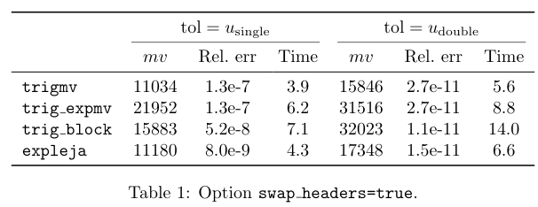
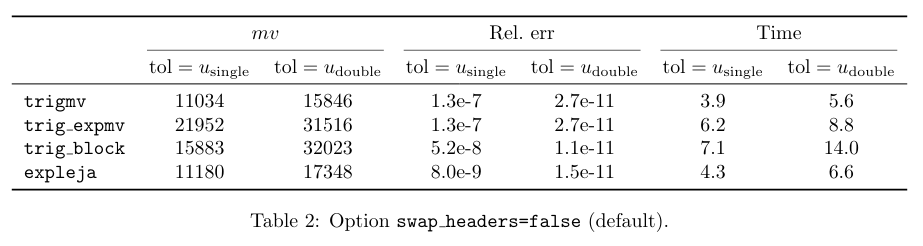

# StructuredLaTeXTables.jl

<!--


 -->
<!--
[](https://travis-ci.com/alanderos91/StructuredLaTeXTables.jl)
[](http://codecov.io/github/alanderos91/StructuredLaTeXTables.jl?branch=master) -->
<!--
[](https://alanderos91.github.io/StructuredLaTeXTables.jl/stable)
[](https://alanderos91.github.io/StructuredLaTeXTables.jl/dev)
-->

This package generates (mostly) publication-ready tables from a structured `DataFrame`.
Specifically, the contents of the table are assumed to have some associated metadata that should also be displayed.

This package has come about as a result of various scripts I wrote at some point for my own work.
[This blog post](https://nhigham.com/2019/11/19/better-latex-tables-with-booktabs/) and this [neat Julia package](https://github.com/korsbo/Latexify.jl) were sources of inspiration.
Hopefully the ideas here will eventually propagate to [Latexify.jl](https://github.com/korsbo/Latexify.jl) or the Julia ecosystem in some form.

## Philosophy

1. Leave data transformations to external tools; e.g. from DataFrames.jl.
2. Focus on specifying structure; let the computer do "most" of the formatting.
3. Avoid using lines, cluttered text, and other excessive details to tell a story.

## Demo

Given the following `DataFrame`:
```julia
using DataFrames

trigmv = "\\trigmv";
trig_expmv = "\\trigexpmv";
trig_block = "\\trigblock";
expleja = "\\expleja";
tols = "\$\\tol=\\tols\$";
told = "\$\\tol=\\told\$";

df1 = DataFrame(
    method=repeat([trigmv, trig_expmv, trig_block, expleja], 2),
    mv=[11034, 21952, 15883, 11180, 15846, 31516, 32023, 17348],
    error=[1.3e-7, 1.3e-7, 5.2e-8, 8.0e-9, 2.7e-11, 2.7e-11, 1.1e-11, 1.5e-11],
    time=[3.9, 6.2, 7.1, 4.3, 5.6, 8.8, 1.4e1, 6.6],
    tol=repeat([tols, told], inner=4),
)
# 8×5 DataFrame
#  Row │ method       mv     error    time     tol            
#      │ String       Int64  Float64  Float64  String         
# ─────┼──────────────────────────────────────────────────────
#    1 │ \\trigmv     11034  1.3e-7       3.9  $\\tol=\\tols$
#    2 │ \\trigexpmv  21952  1.3e-7       6.2  $\\tol=\\tols$
#    3 │ \\trigblock  15883  5.2e-8       7.1  $\\tol=\\tols$
#    4 │ \\expleja    11180  8.0e-9       4.3  $\\tol=\\tols$
#    5 │ \\trigmv     15846  2.7e-11      5.6  $\\tol=\\told$
#    6 │ \\trigexpmv  31516  2.7e-11      8.8  $\\tol=\\told$
#    7 │ \\trigblock  32023  1.1e-11     14.0  $\\tol=\\told$
#    8 │ \\expleja    17348  1.5e-11      6.6  $\\tol=\\told$
```

We can approximately recreate the [second table here](https://nhigham.com/2019/11/19/better-latex-tables-with-booktabs/).

```julia
make_latex_tabular(df1,
    data=[:mv => raw"$mv$", :error => raw"Rel.~err", :time => raw"Time"],
    metadata=[:method => "", :tol => "not used here"],
    emphasis=:tol, # need emphasis in metadata
    swap_headers=true,
)
# "\\begin{tabular}{lcccccc}\n\\toprule\n& \\multicolumn{2}{c}{\$mv\$} & \\multicolumn{2}{c}{Rel.~err} & \\multicolumn{2}{c}{Time} \\\\\n\\cmidrule(lr){2-3}\\cmidrule(lr){4-5}\\cmidrule(lr){6-7}\n& \$\\tol=\\tols\$ & \$\\tol=\\told\$ & \$\\tol=\\tols\$ & \$\\tol=\\told\$ & \$\\tol=\\tols\$ & \$\\tol=\\told\$ \\\\\n\\midrule\n\\trigmv & 11034 & 15846 & 1.3e-7 & 2.7e-11 & 3.9 & 5.6 \\\\\n\\trigexpmv & 21952 & 31516 & 1.3e-7 & 2.7e-11 & 6.2 & 8.8 \\\\\n\\trigblock & 15883 & 32023 & 5.2e-8 & 1.1e-11 & 7.1 & 14.0 \\\\\n\\expleja & 11180 & 17348 & 8.0e-9 & 1.5e-11 & 4.3 & 6.6 \\\\\n\\bottomrule\n\\end{tabular}"
```



It is also possible to swap nesting order of columns:


